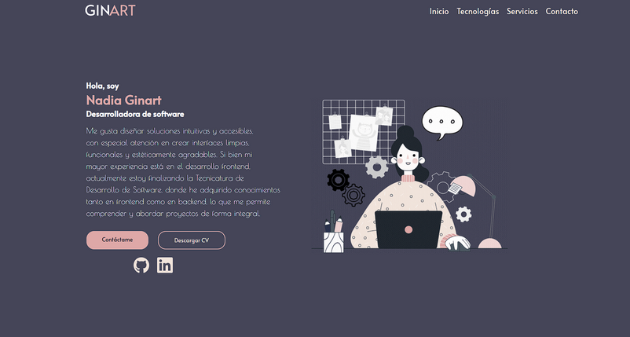

# Portfolio_2025
Práctica formativa- Desarrollo de Sistemas Web FrontEnd IFTS Nº29.
Este es un portfolio web personal que desarrollé como parte de materia
Desarrollo Web FrontEnd. 
Incluye secciones como presentación personal, servicios, tecnologías y formulario de contacto.

Tecnologías utilizadas: 

HTML5

CSS3 (con Media Queries para responsive design)

Font Awesome

Mi portfolio:

